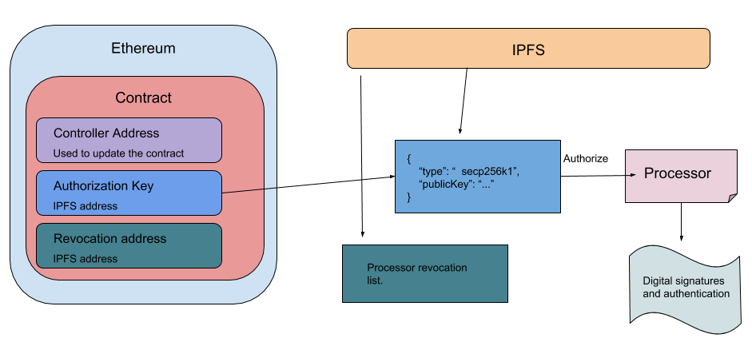

# EthB-DID Library

> A library to create and manage Ethb-DIDs.

This reference implementation facilitates a hybrid DID method that combines the best of the Ethereum blockchain and IPFS.

The goal of this method is to minimize the amount of storage used, and transactions made on the Blockchain to maximize efficency. This is attempted by only storing the necessaries on the chain, such as the controller address, and IPFS pointers to more cryptographic material.

Here is an overview of the method:




### Installation

1. Clone the `ethb-did`.
2. ```cd ethb-did/```
3. ```npm install```

### Simple Usage

1. Connect to an Ethereum network with an `ethers` provider.

```javascript
    import { JsonRpcProvider, Web3Provider } from "ethers/providers";

    let rpcProvider = new JsonRpcProvider(<RPC_HOST>);
```
2. Create a new DID.

```javascript
    import { EthBDID} from "ethb-did";

    // Connect to an IPFS node
    EthBDID.connectToIpfs("<IPFS_HOST>");

    // Choose a funded Ethereum account.
    let ethPrivateKey = "c71be7eedb2030b8a6f81432d8f1e00dc98e84a17f42813c290b25a76a2a7724":
    let ethAddress = "0x9352C5b3345Acb6dDe06A756B6b8414524CcA310p";

    // Choose a Secp256k1 key pair for authorization.
    let authPrivateKey = "80226bf3ec016b9d3b7d9037fe3008889977a57f43e9bb8484d59f77c58e9777";
    let authPublicKey = "04f88e3cec86d4b5f6c731a1e42a0f81ec821413ce1b87f605bf3cc16a3d39715a039201a4b32e57d744163cb04034c2b47816d3e29e173f5af8"347642126849d2"";

    // Create the DID.
    let did = await EthBDID.create(ethPrivateKey, ethAddress, athPrivateKey, authPublicKey, rpcProvider);

    console.log("did:", did.getUri());
```

3. Create and authorize a processor.
```javascript
    import { Processor } from "ethb-did"

    // Choose a Secp256k1 key pair for the processor.
    let processorPrivateKey = "dfa3ba5fb5d88f5b3efa402532aa2e58d01ecee268acf0440b4246fd5fafc450";
    let processorPublicKey = "043a34227d11eb56c156ca44c9b0c6b1ba0aeef9be9d10a3dcbc2c7cd7d96d9c26b44b246e9f4bd26d1ff8aaa98df3cbe2ae8ab3262bc69d83745a91cf4c03d883";

    // Authorize the processor.

    let processor = did.authorizeProcessor(processorPublicKey, true, true, authPrivateKey);
```
4. Create JWT.

```javascript
    let claims = {key: "value"};
    let expiresIn = "1 year";

    let jwt = processor.createJwt(claims, expiresIn, processorPrivateKey);
```

5. Verify JWT.

```javascript
    did.verifyJwt(jwt).then((result) => {
        console.log("JWT is valid");
      }).catch((err) => {
        console.log("JWT is invalid");
      });
```


